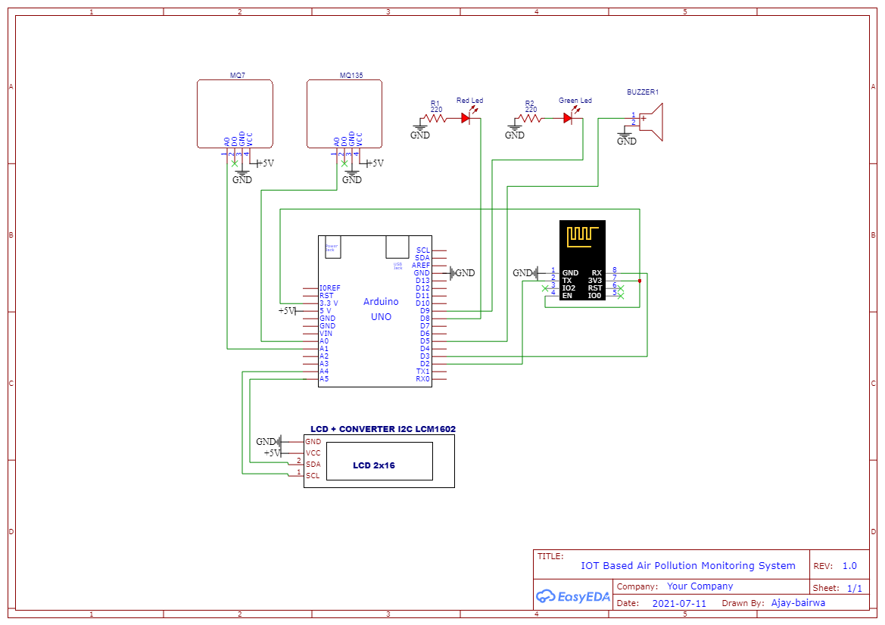

# Air Pollution Monitoring System

This is **IOT based Air Pollution Monitoring System** which measures indoor harmful gases present in air like Carbon Dioxide(CO2) using an MQ135 gas sensor and Carbon Monoxide(CO) using an MQ7 sensor. It will show the air quality in PPM(Parts Per Million) on the LCD and as well as on [Thingspeak](https://thingspeak.com/channels/1347787) so that we can monitor it very easily in PPM.

## Components Requirement:
- Arduino Uno
- Wi-Fi module Node-MCU ESP8266
- 16x2 LCD
- MQ135 Gas sensor
- MQ 7 LPG gas sensor
- Buzzer
- LEDs

## System Architecture:

## Software Requirement:
- [Arduino IDE](https://www.arduino.cc/)
> Arduino IDE used to upload programming in Arduino board and Node-MCU board with required library.
- [Thingspeak](https://thingspeak.com/)
> ThingSpeak is an IoT analytics platform service that allows you to aggregate, visualize, and analyze live data streams in the cloud. You can send data to ThingSpeak from your devices, create instant visualization of live data, and send alerts.

## Measurement:
The most important step is to calibrate the sensor in fresh air and then draw an equation that converts the sensor output voltage value into our convenient units PPM (parts per
million). Here are the mathematical calculations derived:

For a log-log scale, the formula looks like this:

Let’s find the slope. The formula to calculate slope m(here) is the following:

If we apply the logarithmic quotient rule we get the following:

Now we substitute the values for x, x0, y, and y0.
Now that we have m and b, we can find the gas concentration for any ratio with the following formula:

Using this we will be able to convert the sensor output values into PPM (Parts per Million)

However, in order to get the real value of the gas concentration according to the log-log plot we need to find the inverse log of x:

> More details for calculation [here](assets/docs/Final_Paper.pdf)

> Datasheets for:
  - [MQ135](https://www.olimex.com/Products/Components/Sensors/Gas/SNS-MQ135/resources/SNS-MQ135.pdf)
  - [MQ7](https://www.sparkfun.com/datasheets/Sensors/Biometric/MQ-7.pdf)
 
## Results:

   
  

  

> **More details found in Document [here](assets/docs/Air_Pollution.pdf)**

## Credit:
- [AJAY KUMAR BAIRWA](https://www.linkedin.com/in/ajay-bairwa)
- [SURENDRA KUMAR](https://www.instagram.com/suruu.meena/)
- [ROHIT KUMAR](https://www.instagram.com/rohit_meena__23/)
